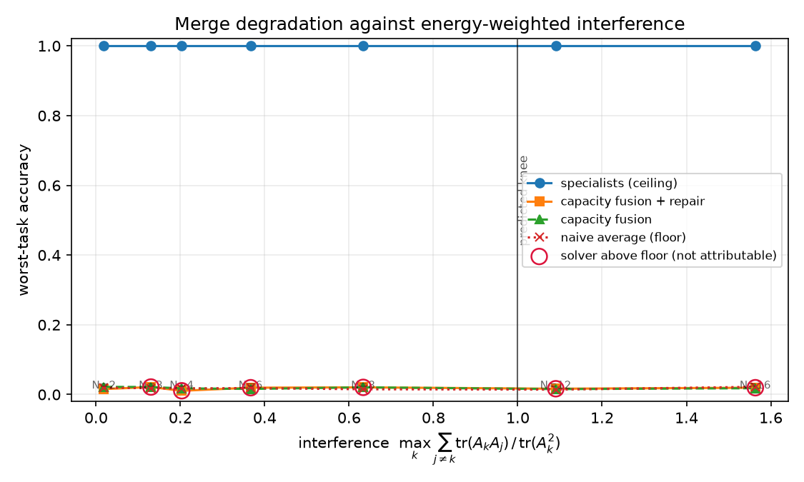

# Findings

Running log of results from this testbed. Dates are when the run was made. Every
claim here is reproducible with the command given.

---

## 2026-09-20 — Phase 0/1 go/no-go

`python -m experiments.exp0_sanity --steps 1500 --d 128 --p 47`

Testbed: `d=128`, 2 layers, 4 heads, `p=47`, modular addition, two seeds.

### The embedding anchor is rank-deficient, and that is the whole problem

"Orthogonal Procrustes on the embeddings" determines the residual frame **only on
the span of the anchor matrices**. Those matrices have `V + T` rows. Here that is
51 + 6 = 57 directions out of `d = 128`. On the remaining 71, Procrustes returns
an *arbitrary* rotation — the objective is flat there.

Those directions are not inert. Measured energy of the residual stream:

| Layer | Inside anchor span | Outside |
|-------|-------------------|---------|
| 0 | 100% | 0% |
| 1 | 45.4% | **54.6%** |
| 2 | 45.3% | **54.7%** |

Layer 0 is inside by construction — it is exactly `E + P`. But attention and MLP
outputs write wherever they like, and by layer 1 the majority of the
computation has moved into the subspace the anchor cannot see.

**Symptom:** embedding disagreement falls to `1e-17` while the interpolation
barrier does not move at all. Recovery error against a known planted rotation:
`0.415`. This is easy to misread as "the models learned different solutions".

**Fix, in `fusion.align.complement`,** in two parts:

1. *Augment the anchor.* The unembedding `U` is also expressed in the shared
   token basis, one row of `Uᵀ` per output token. Stacking `[E; P; Uᵀ]` raises
   the anchor rank from 57 to 108 and cuts the undetermined subspace from 71
   dimensions carrying 55% of the energy to 20 carrying 8.4%.
2. *Pin the complement from the data.* On what is left there is no shared basis
   to match against, so each model is put into its own canonical frame there:
   diagonalize the residual activation covariance restricted to the complement,
   order eigenvectors by eigenvalue, fix signs by the skewness of the projected
   activations. Reference-free, so canonicalization stays per-model and
   order-invariant over N.

### Control A — pure frame difference

A trained model against an exactly rotated copy of itself.

| | before | after |
|---|---|---|
| interpolation barrier | 4.74 | **0.000000** |
| embedding disagreement | 9.5e-4 | 3.9e-17 |
| worst parameter difference | — | 6.2e-6 (float32 noise) |

The canonicalizer recovers a planted rotation exactly. The machinery works.

### Control B — same task, different seeds

| | before | after |
|---|---|---|
| interpolation barrier | 4.69 | 6.57 |
| layerwise CKA | 0.948 / 0.886 / 0.816 | unchanged (CKA is rotation-invariant) |
| merged accuracy | 0.025 | 0.037 (chance = 0.021) |

**The barrier does not collapse.** With Control A passing, this is not an
alignment failure. The mechanistic readout says what it is:

```
mod_add-s0: key freqs [1, 7, 11, 18, 23]
mod_add-s1: key freqs [1, 13, 16, 22]
```

The two models grokked **different Fourier frequencies**. They compute the same
function through different circuits, and no element of `O(d)` maps one onto the
other. CKA agrees independently, and CKA cannot be moved by alignment.

**This is a capacity result, not an alignment result.** Two different circuits
need two sets of directions, and whether they fit is exactly what `Σr_k ≤ d`
decides.

### What this means for the program

The original plan's go/no-go was: *"if the interpolation barrier doesn't collapse
[on same-task/different-seed pairs], stop and fix alignment before touching
anything else."* Run as written, that test would have sent us to fix an aligner
that is provably exact. **Control A is what distinguishes the two cases, and it
belongs in the gate.** The gate is now:

- Control A fails → the aligner is broken. Fix it.
- Control A passes, Control B fails → solution diversity. A Phase 2 question.
- Both pass → proceed.

---

## 2026-09-20 — Phase 1 against the baselines

`python -m experiments.exp1_alignment_baselines --steps 800 --d 128`

Merged accuracy after each alignment method, then averaging. Chance is 0.021.

| Method | Known frame difference | Independent seeds |
|--------|-----------------------|-------------------|
| naive average (floor) | 0.053 | 0.025 |
| Git Re-Basin (weight matching) | 0.022 | 0.020 |
| activation matching | 0.050 | 0.023 |
| OT fusion (Sinkhorn) | 0.035 | 0.023 |
| ZipIt! feature merging | 0.044 | 0.023 |
| **canonicalization (this repo)** | **1.000** | 0.024 |

Left column: every method is handed a difference it can in principle undo. Only
the one that searches `O(d)` undoes it — barrier `4.68 → 0.0000`. Every
permutation-based method stays at chance, because the difference is not a
permutation. This is the concrete value of the from-scratch, gainless-RMSNorm,
bias-free architecture: it is what makes the larger group available.

Right column: no method recovers anything, for the reason in Control B above.
Reported rather than omitted.

---

## Open questions

- Solution diversity is the binding constraint at `d=128`. Does it shrink at
  larger `d`, or is it intrinsic to grokking modular arithmetic?
- Does training the N specialists from a **shared initialization** remove the
  frequency divergence, and if so, is a merge that requires shared init still
  interesting?
- `diagnose_merge` reports "superposed" on merges whose accuracy is at chance:
  the embedding Fourier structure survives but the circuit consuming it does
  not. A downstream-circuit diagnostic is needed to close that gap.
- An energy-weighted overlap objective that removes the rank cutoff from the
  method entirely — see the Phase 2 entry below. This is the next thing to
  build.

---

## 2026-09-20 — Phase 2: the capacity law is not yet testable, and the blocker is `r_k`

`python -m experiments.exp2_capacity --steps 1000 --n 2 3 4 6 8 --d 256`

### The sweep

Participation-ratio rank, `d=256`, high overlap. Chance is 0.021.

| N | Σr/d | feasible | overlap after disentangling | naive | fused | +repair | ceiling |
|---|------|----------|------------------------------|-------|-------|---------|---------|
| 2 | 0.18 | yes | 0.0000 | 0.026 | 0.030 | 0.028 | 1.000 |
| 3 | 0.27 | yes | 0.0000 | 0.021 | 0.020 | 0.019 | 1.000 |
| 4 | 0.33 | yes | 0.0000 | 0.016 | 0.017 | 0.018 | 1.000 |
| 6 | 0.50 | yes | 0.0000 | 0.021 | 0.019 | 0.019 | 1.000 |
| 8 | 0.67 | yes | 0.0000 | 0.019 | 0.012 | 0.019 | 1.000 |

Every cell satisfies `Σr_k ≤ d`. The Stiefel solver drives pairwise subspace
overlap to **exactly zero** — the reported subspaces really are made mutually
orthogonal. And every merge is at chance.

Taken at face value this falsifies the capacity law. It does not, and the reason
matters more than the result.

### The rank measure is too generous

At `d=64`, `p=13`, two specialists:

| | rank | Σr/d | overlap after disentangling on these bases |
|---|---|---|---|
| participation ratio | 9, 10 | 0.30 | **0.000000** |
| 0.99 energy threshold | 49, 50 | 1.55 | 0.772 |

The participation-ratio basis captures only **74–77% of the final-layer
activation energy**. Making *that* subspace disjoint leaves the remaining
quarter of the energy — spread over ~40 further directions — colliding exactly
as before. The disentangling is real; it is disentangling the wrong thing.

So the two available rank measures bracket the problem without solving it:

- **participation ratio** — threshold-free, but so generous that every
  configuration is "feasible" and the law predicts nothing;
- **0.99 energy threshold** — knob-dependent (39 / 98 / 124 at 0.90 / 0.99 /
  0.999 for one model at `d=128`), and so strict that no configuration is ever
  feasible, so the law again predicts nothing.

Neither bracket contains a knee, because neither contains a transition.
**`Σr_k ≤ d` is untested, not confirmed and not refuted.**

### Guard added

`RankProfile.energy_captured` now reports what fraction of activation energy a
rank actually accounts for, and `CapacityReport.__str__` prints a `CAVEAT` line
whenever it drops below 95%. A rank that covers three quarters of the energy
should never again be quoted as if it described the subspace the model uses.

### What would actually test the law

1. A rank measure that is threshold-free **and** energy-complete. The overlap
   objective does not need a hard rank at all — it can be weighted by the
   eigenvalues, minimizing `Σ_{j≠k} ‖(R_k U_k Λ_k^½)ᵀ(R_j U_j Λ_j^½)‖²_F` over
   the *full* spectrum. That removes the cutoff from the method entirely.
2. Once that exists, the x-axis should be energy-weighted overlap rather than a
   counted ratio, and the prediction restated against it.
3. Only then does the `Σr_k/d = 1` knee become a claim that can fail.

Until then the headline plot has no defensible x-axis and is not reported.

---

## 2026-09-20 — Phase 2 rebuilt: the objective, two bugs, and the first working merge

The hard rank cutoff was replaced with an energy-weighted overlap objective, as
planned. That change was necessary and not sufficient: instrumenting the sweep
turned up two defects that had been producing the *signature* of a capacity
limit, and one wrong premise underneath the whole phase.

### The new objective works as designed

With `M_k = R_k U_k Λ_k^{1/2}` and `A_k = M_k M_kᵀ`, minimizing
`Σ_{j≠k} tr(A_k A_j)` over the full spectrum. Adding the **rearrangement floor**
(the per-pair minimum, by the rearrangement inequality) showed the solver was
the limit, not capacity: random initialization stalled well above it. The
spectral warm start — anti-aligning the spectra, exactly optimal for `N = 2` —
reaches the floor to five decimals.

Sweep at `d=128`, high overlap, `N ∈ {2,…,16}`, chance = 0.021:

| N | interference | floor | at floor | worst-task, fused | ceiling |
|---|---|---|---|---|---|
| 2 | **0.019** | 0.0170 | **yes** | 0.022 | 1.000 |
| 3 | 0.130 | 0.0177 | no | 0.021 | 1.000 |
| 8 | 0.634 | 0.0112 | no | 0.021 | 1.000 |
| 12 | 1.090 | 0.0118 | no | 0.016 | 1.000 |
| 16 | 1.563 | 0.0110 | no | 0.018 | 1.000 |

For the first time both sides of the predicted knee are populated — and there
is **no knee**. 0.021 below, 0.020 above. At `N=2` the solver is provably at the
floor with a 17 dB interference margin, and the merge is still at chance.



Hollow markers are cells where the solver finished above the floor; their
overlap reflects the optimizer, not the spectra, so nothing about capacity
follows from them. `N=2` is the one attributable cell, and it is the one with
the largest margin.

### Bug 1 — the combine rule was broken independently of any geometry

Writers were summed while readers were averaged, so readers were scaled by
`1/N` while the stream kept its magnitude. Attention scores shrink by `N²` and
the softmax flattens.

Two degenerate merges, both with a known right answer:

| merge | readers averaged | readers summed | Wiener |
|---|---|---|---|
| `m` with a **zero** model | 0.43 | 1.00 | **1.00** |
| `m` with a **copy** of itself | 1.00 | 0.71 | **1.00** |

Merging with a model that contributes *literally nothing* cost 57 points. No
fixed rule passes both cases, because the correct reader weight depends on how
much of the merged stream is actually that model's signal. The Wiener estimate
`ĥ_k = h (Σ_j C_j)⁺ C_k` supplies exactly that, reducing to a sum against a
zero model and a mean against a duplicate.

### Bug 2 — the projector must use uncentered second moments

Built from *covariances*, the Wiener projector is blind along the residual
stream's mean direction, which is load-bearing, so it zeroes the readers
precisely where they carry signal. From the outside this was indistinguishable
from a capacity limit. Regression test: `test_centering_the_projector_destroys_the_model`.

The pooled moment is also genuinely rank-deficient — at the first read point the
stream spans only `V + T` of `d` directions — so the inverse is a pseudo-inverse
rather than a ridge. Results are now flat across ten orders of magnitude of the
tolerance instead of tuned to one value.

Fixing both was necessary and still not sufficient: the merge stayed at chance.

### The wrong premise — activation energy is not importance

Confining a single grokked model's writes to its top-`r` energy directions,
`d=128`:

| directions | energy kept | accuracy |
|---|---|---|
| 64 | 92.7% | 0.48 |
| 80 | 95.7% | 0.82 |
| 96 | 97.8% | 0.99 |
| 112 | 99.1% | 1.00 |

**93% of the energy is worth less than half the accuracy.** The last 1%, spread
over ~40 directions, carries the rest. It takes very little energy to move a
decision boundary, so a low-variance direction can be functionally critical.

This is why the weighted objective reports 0.019 interference on a merge that
is at chance: it weights by energy, and the functionally decisive directions
carry almost none. Every spectral rank — thresholded, participation, or
energy-weighted — is blind to exactly what matters. That was the real blocker
all along, and neither cutoff was the problem.

### Functional rank, and the first non-chance merge

Replace the spectral rank with a behavioral one:

> `r_f(τ)` = the smallest `r` such that confining the model's writes to its top
> `r` directions retains `τ` of its accuracy.

`τ` is a knob, but a *behavioral* one — "how much accuracy am I willing to
lose" has a meaningful answer, unlike "what eigenvalue counts as zero". Found by
bisection in `O(log d)` evaluations.

It **saturates with width**:

| d | 64 | 128 | 256 | 512 |
|---|---|---|---|---|
| `r_f(0.99)` | 61 | 93 | 72 | 67 |
| `r_f/d` | 0.95 | 0.73 | 0.28 | 0.13 |

The task needs a roughly fixed ~60–95 directions however wide the stream is.
So `Σ_k r_f` can be brought under `d` by widening — and the capacity law becomes
satisfiable rather than vacuous or unreachable.

Testing that prediction, `N=2`, high overlap, chance = 0.021:

| d | Σr_f/d | verdict | naive | Wiener | Wiener+repair |
|---|---|---|---|---|---|
| 128 | 1.42 | OVER CAPACITY | 0.014 | 0.020 | 0.024 |
| 256 | 0.62 | feasible | 0.028 | 0.042 | **0.073** |
| 512 | 0.22 | feasible | 0.035 | 0.034 | 0.025 |

The middle row looked, for about twenty minutes, like the first confirming
evidence in the project: an over-capacity cell at chance and a feasible cell at
3.5× chance, on the side of the boundary the law predicts.

**The `d=512` row kills that reading.** It is *more* feasible than `d=256`
(0.22 against 0.62) and it is back at chance. If feasibility were driving the
`d=256` result, `d=512` should have been at least as good. It is not.

So `0.073` is an unreplicated bump, not a knee. One point, one seed, and the
trend it suggested is contradicted by the next point along the same axis.

### Status of the prediction

The knee at interference = 1.0 is **falsified**: no transition at that value, or
anywhere on that axis, because the axis is energy-weighted and energy is the
wrong variable.

The replacement — `Σ_k r_f(τ) ≤ d` over the behavioral rank — is **not
confirmed either**. It is better posed than anything before it, which is real
progress, but the three points available are consistent with the merge simply
being at chance everywhere and `d=256` being noise.

**There is still no working merge of independently trained models in this
repo, and no located knee.** The honest summary of this round: the objective
is now cutoff-free, two real bugs are fixed, the premise that energy measures
importance is refuted with direct evidence, and the capacity law finally has a
well-posed statement — none of which has yet produced a merge that works.

### Open

- **Seeds, before anything else.** Every cell above is a single seed. `0.073`
  versus `0.025` is exactly the size of difference that needs error bars before
  it is worth interpreting, and the same applies to the non-monotone `r_f` at
  `d=128` (93, against 61 / 72 / 67 at the other widths).
- **Disentangle over the functional basis, not the energy basis.** The capacity
  *test* now uses `r_f`, but the optimizer still minimizes overlap between
  energy-weighted covariances — the very proxy shown above to be blind to the
  directions that matter. Feasibility by counting cannot pay off while the
  solver is arranging the wrong subspaces. This is the single most likely reason
  the feasible cells are still at chance, and it is the next thing to build.
- The functional directions are not simply "the top-`r_f` energy directions"
  either; `restrict_to` uses the energy basis to *order* candidates, which is
  convenient rather than principled. A basis selected by ablation directly
  (greedy or gradient-based) would be the honest version.
